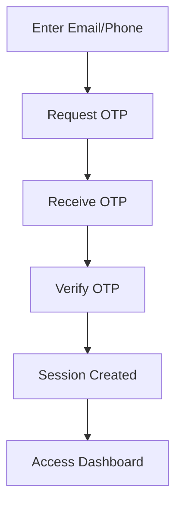
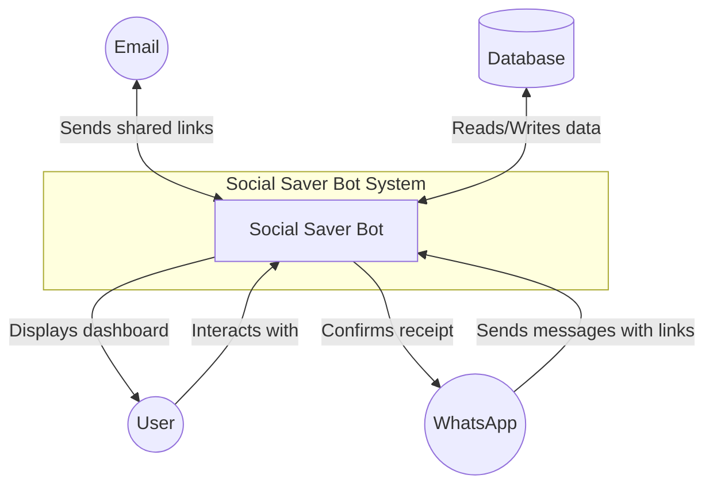

# Hack-the-Thread-Social-Saver-Bot-Prototype

A smart bookmarking tool that saves and organizes links from WhatsApp messages, with a beautiful dashboard to view, search, filter, and share your saved content.

## 🎯 Overview

Social Saver Bot helps you never lose interesting links shared on WhatsApp again. Simply forward messages containing links to your bot, and they'll be automatically saved, organized by platform, and accessible through a beautiful dashboard.

# Watch demo video 

## click on this badge to see

### Perfect for:
- **Content curators** saving inspiration from social media
- **Researchers** collecting resources from WhatsApp groups
- **Teams** sharing relevant links with each other
- **Personal use** bookmarking interesting content on the go

##  Features

### Core Functionality
- ** WhatsApp Integration** - Save links directly from WhatsApp messages via webhook
- ** Passwordless Authentication** - Login with email or phone using OTP
- ** Beautiful Dashboard** - View all your saved links in a clean, organized interface
- ** Smart Search & Filtering** - Search by title or filter by platform
- ** Email Sharing** - Share collections of links with formatted previews

### Platform Detection
Automatically detects and tags links from:
- Instagram
- Twitter/X
- YouTube
- Dribbble
- Blog posts (Medium, Substack, etc.)
- Other websites

  

## 🛠️ Tech Stack

### Frontend
| Technology | Purpose |
|------------|---------|
| Next.js 15 | React framework with App Router |
| TypeScript | Type safety and better developer experience |
| Tailwind CSS 4 | Styling and responsive design |
| Radix UI | Accessible UI primitives |
| SWR | Data fetching and caching |
| next-themes | Dark/light mode support |
| Lucide React | Icon library |
| Sonner | Toast notifications |

### Backend
| Technology | Purpose |
|------------|---------|
| Next.js API Routes | Backend API endpoints |
| Prisma | ORM for database operations |
| SQLite/PostgreSQL | Database (SQLite for dev, PostgreSQL for prod) |
| Session Cookies | Authentication management |
| Custom Validation | Input validation utilities |

##  Authentication Flow

## Data Flow Diagram

