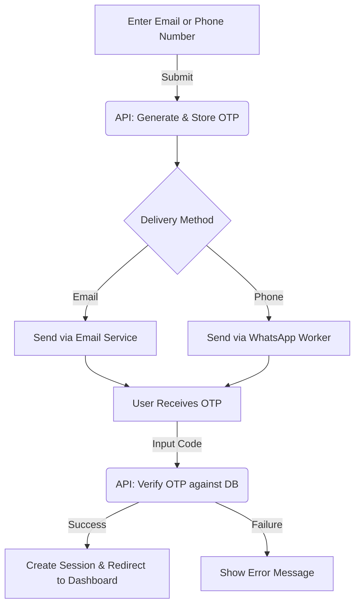
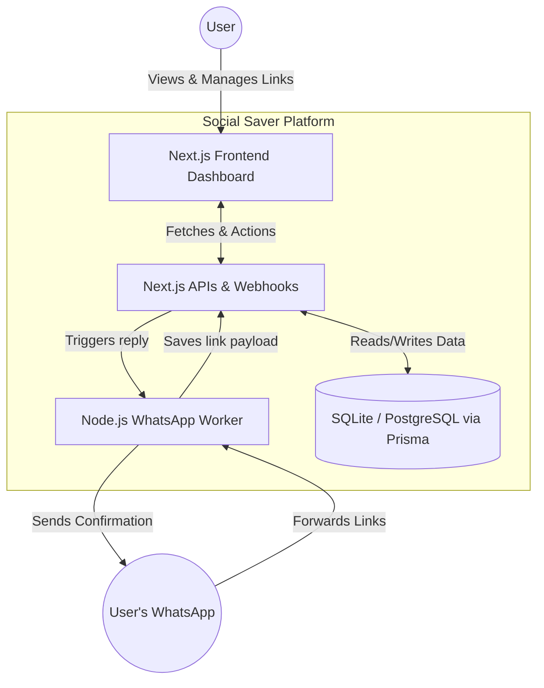
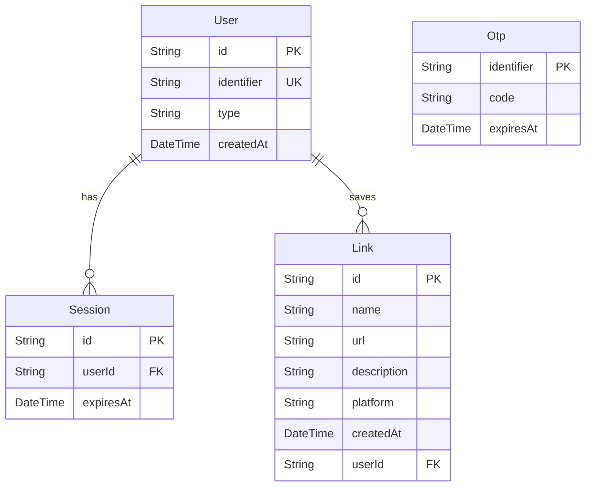

# Hack-the-Thread-Social-Saver-Bot-Prototype

[](https://github.com/ankush850/Hack-the-Thread-Social-Saver-Bot-Prototype)
[](https://nextjs.org)
[](https://www.typescriptlang.org)
[](https://react.dev)
[](https://tailwindcss.com)
[](https://www.prisma.io)
[](https://github.com/ankush850/Hack-the-Thread-Social-Saver-Bot-Prototype)


A smart bookmarking tool that saves and organizes links from WhatsApp messages, with a beautiful dashboard to view, search, filter, and share your saved content.


## 🎯 Overview

Social Saver Bot helps you never lose interesting links shared on WhatsApp again. Simply forward messages containing links to your bot, and they'll be automatically saved, organized by platform, and accessible through a beautiful dashboard.


# Watch demo video 

[](https://drive.google.com/file/d/1ykjenvMyH7XygMGk8JxJesTQdCHNkvxi/view?usp=drive_link)  <==>  ## Click on this badge to see.

### Perfect for:
- **Content curators** saving inspiration from social media
- **Researchers** collecting resources from WhatsApp groups
- **Teams** sharing relevant links with each other
- **Personal use** bookmarking interesting content on the go

##  Features

### Core Functionality
- ** WhatsApp Integration** - Save links directly from WhatsApp messages via webhook
- ** Passwordless Authentication** - Login with email or phone using OTP
- ** Beautiful Dashboard** - View all your saved links in a clean, organized interface
- ** Smart Search & Filtering** - Search by title or filter by platform
- ** Email Sharing** - Share collections of links with formatted previews


### Platform Detection
Automatically detects and tags links from:
- Instagram
- Twitter/X
- YouTube
- Dribbble
- Blog posts (Medium, Substack, etc.)
- Other websites

  


## 🛠️ Tech Stack

### Frontend
| Technology | Purpose |
|------------|---------|
| Next.js 15 | React framework with App Router |
| TypeScript | Type safety and better developer experience |
| Tailwind CSS 4 | Styling and responsive design |
| Radix UI | Accessible UI primitives |
| SWR | Data fetching and caching |
| next-themes | Dark/light mode support |
| Lucide React | Icon library |
| Sonner | Toast notifications |

### Backend
| Technology | Purpose |
|------------|---------|
| Next.js API Routes | Backend API endpoints |
| Prisma | ORM for database operations |
| SQLite/PostgreSQL | Database (SQLite for dev, PostgreSQL for prod) |
| Session Cookies | Authentication management |
| Custom Validation | Input validation utilities |


##  Authentication Flow



## Data Flow Diagram


## Entity Relationships


## 🚀 Getting Started

### Prerequisites

```bash
Node.js 18.17 or later
npm or yarn package manager
Git
(Optional) PostgreSQL for production
```
### Installation Steps


1. **Clone the repository**

```bash
git clone https://github.com/ankush850/Hack-the-Thread-Social-Saver-Bot-Prototype.git
cd Hack-the-Thread-Social-Saver-Bot-Prototype
```

2. **Install dependencies for the main app**

```bash
npm install
```
# *IMP = After getting node_modules go copy-paste to whatsapp-worker


3. **Install dependencies for the WhatsApp Worker**

```bash
cd whatsapp-worker
npm install
cd ..
```

4. **Set up environment variables**

```bash
cp .env.example .env
# Update the .env file with your required configuration.
```

5. **Initialize the database**

```bash
npm run db:migrate
```

6. **Start the development server (Main App)**

```bash
npm run dev
```

7. **Start the WhatsApp Worker**
Open a new terminal session, run the following to start the worker, and scan the QR code to link your WhatsApp:

```bash
# On Windows
start-worker.bat

# Or manually
cd whatsapp-worker
npm start
```

8. **Open your browser**
Navigate to `http://localhost:3000` to interact with the frontend.
## Project Structure

```
hack-the-thread-social-saver-bot/
├── app/
│   ├── api/
│   │   ├── auth/
│   │   │   ├── request-otp/
│   │   │   │   └── route.ts
│   │   │   ├── verify-otp/
│   │   │   │   └── route.ts
│   │   │   ├── session/
│   │   │   │   └── route.ts
│   │   │   └── logout/
│   │   │       └── route.ts
│   │   ├── links/
│   │   │   ├── route.ts
│   │   │   └── [id]/
│   │   │       └── route.ts
│   │   ├── share-email/
│   │   │   └── route.ts
│   │   └── webhook/
│   │       └── route.ts
│   ├── layout.tsx
│   ├── page.tsx
│   └── globals.css
├── components/
│   ├── auth/
│   │   ├── auth-provider.tsx
│   │   ├── auth-gate.tsx
│   │   └── login-form.tsx
│   ├── dashboard/
│   │   ├── dashboard.tsx
│   │   ├── add-link-dialog.tsx
│   │   ├── link-grid.tsx
│   │   ├── link-card.tsx
│   │   ├── search-bar.tsx
│   │   ├── stats-bar.tsx
│   │   ├── sidebar-nav.tsx
│   │   └── email-share-dialog.tsx
│   ├── ui/
│   │   ├── button.tsx
│   │   ├── card.tsx
│   │   ├── dialog.tsx
│   │   ├── input.tsx
│   │   ├── label.tsx
│   │   ├── select.tsx
│   │   ├── separator.tsx
│   │   └── skeleton.tsx
│   └── theme-provider.tsx
├── lib/
│   ├── auth.ts
│   ├── data.ts
│   ├── db.ts
│   ├── utils.ts
│   └── platforms.ts
├── prisma/
│   ├── schema.prisma
│   ├── migrations/
│   └── dev.db
├── public/
├── whatsapp-worker/
│   ├── index.js
│   └── package.json
├── .env.example
├── .gitignore
├── package.json
├── start-worker.bat
├── tsconfig.json
├── tailwind.config.ts
├── next.config.mjs
└── README.md
```
